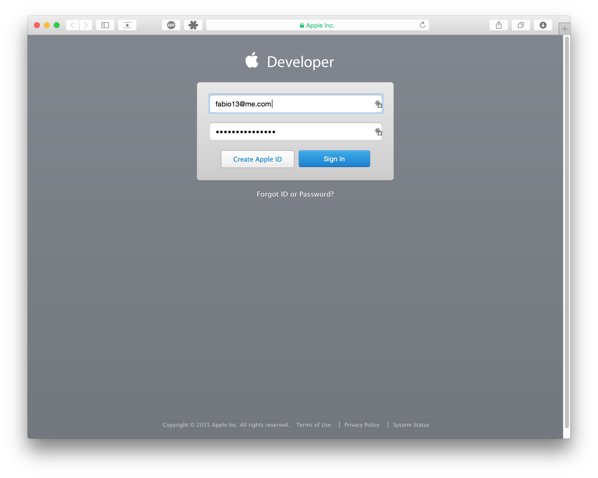
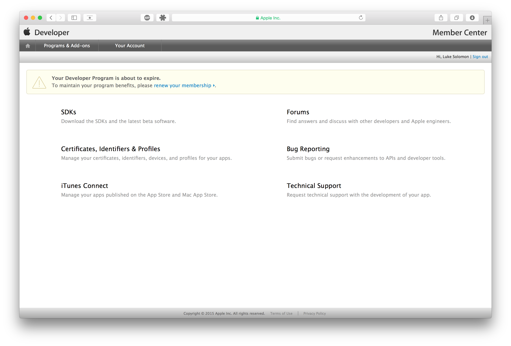
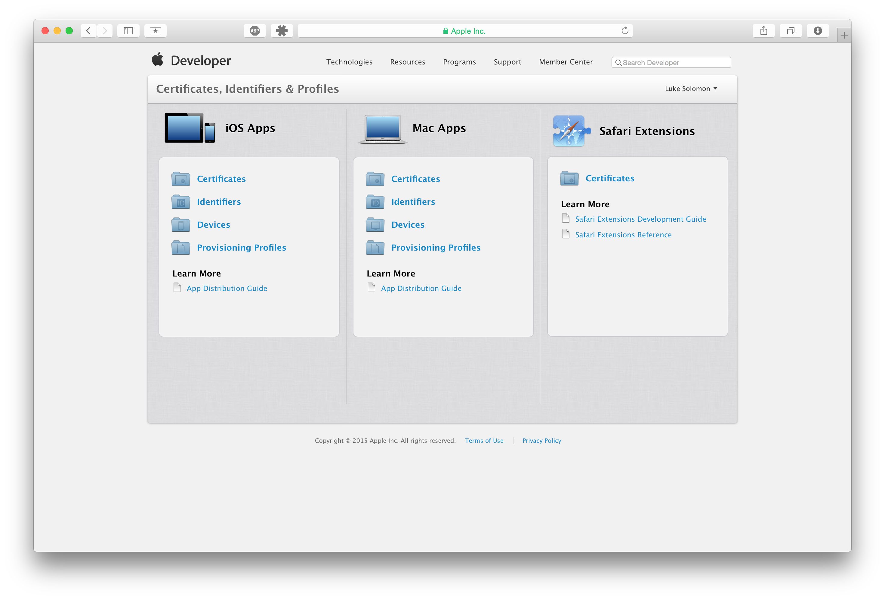
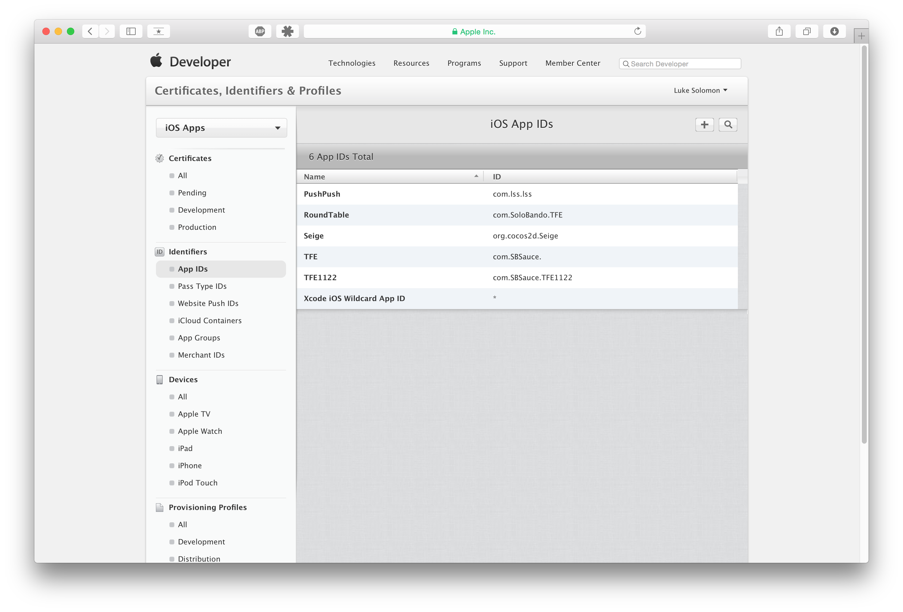
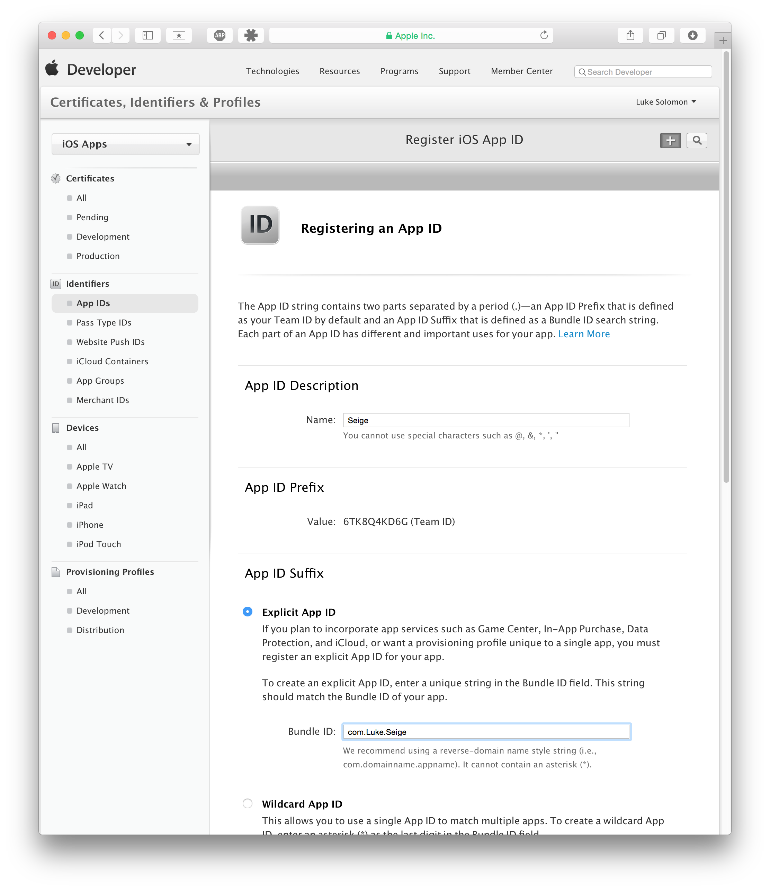
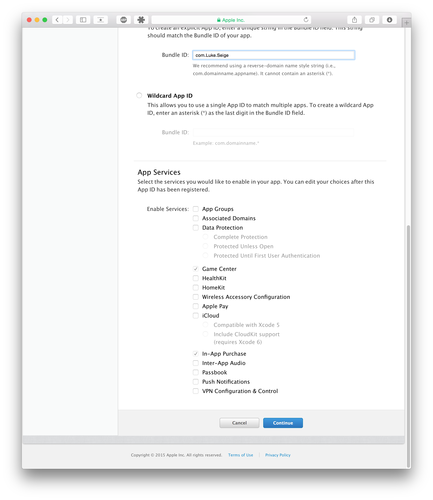
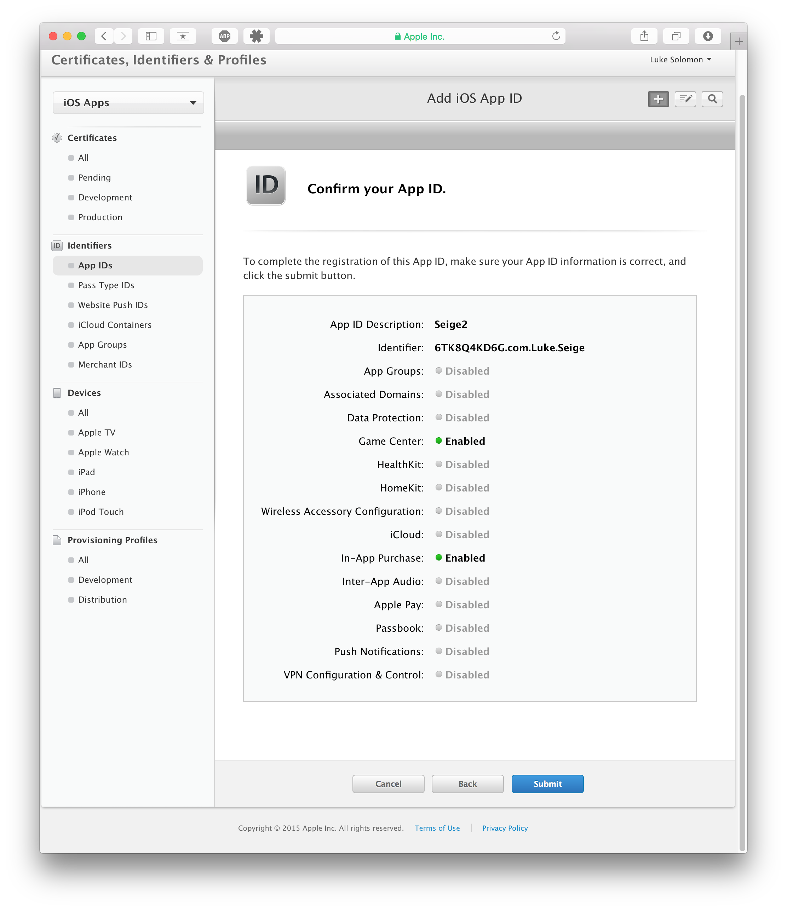

#GameCenter Integration in Swift
###### Written by Luke Solomon

##Introduction
Gamecenter is a Framework that Apple has made available in iOS for developers to very easily track player progress, integrate leaderboards, and allows players to challenge one another (also known as matchmaking). 

This tutorial will show you how to easily add GameCenter into your game to add all these totally awesome and amazing features. I will use my own game, [Seige](http://www.github.com/ares42/seige) for this and several tutorials in the future. Feel free to clone or fork the repository on Github (but star it so that I can get magical internet points).

##Before We Begin
####Please Note: You must have a developer account! If you haven't signed up for one yet, [click here](https://developer.apple.com/programs/enroll/)! 

GameCenter integration is broken down into 3 steps:

1. [iOS Developer Center](https://developer.apple.com/membercenter/)
2. [iTunes Connect](https://itunesconnect.apple.com/)
3. XCode Implementation
	

##1. Developer Center
If you've never used the iOS developer center before, it can be a little intimidating. Don't fret, I'll carefully walk you through this trecherous, dated-looking website. Did I mention you should have a developer account by now? 

[Lets get started. Click here to go to the iOS Developer Center.](https://developer.apple.com/membercenter/)

Enter your credentials...

Click "Certificates, Identifiers, and Profiles"

Under iOS Apps, Click "Identifiers"

Next 

	

#Just regular Markdown

Content...

#Additional Support

We also support:

Action Highlights:

> [action]
> Add the following import statement to the top of _TimelineViewController.swift_:
>
>
    import ConvenienceKit

Info Boxes:
> [info]
> You should be careful
because of X, Y and Z

And hidden solutions:

> [solution]
> This is how it would have worked!

Enumerations should look beautiful, too:

1. Is this good?
2. Or not?
3. Huh?

---
title: "Move on with this tutorial!"
slug: tutorial-page-2
---     

#Just regular Markdown

Content...

