# GameCenter Integration in Swift
###### Written by Luke Solomon

## Introduction
Gamecenter is a Framework that Apple has made available in iOS for developers to very easily track player progress, integrate leaderboards, and allows players to challenge one another (also known as matchmaking). 

This tutorial will show you how to easily add GameCenter into your game to add all these totally awesome and amazing features. I will use my own game, [Seige](http://www.github.com/ares42/seige) for this and several tutorials in the future. [Feel free to clone or fork the repository on Github](http://www.github.com/Seige) (but star it so that I can get magical internet points).

## Before We Begin
#### ProTip: You must have a developer account! If you haven't signed up for one yet, [click here](https://developer.apple.com/programs/enroll/)! 

GameCenter integration is broken down into 3 steps:

1. [iOS Developer Center](https://developer.apple.com/membercenter/)
2. [iTunes Connect](https://itunesconnect.apple.com/)
3. XCode Implementation
	

##1. Developer Center
If you've never used the iOS developer center before, it can be a little intimidating. Don't fret, I'll carefully walk you through this trecherous, dated-looking website. Did I mention you should have a developer account by now? 

#### Please Note: If you've already set up your app in the iOS Developer Center, feel free to skip to the next section.

[Lets get started. Click here to go to the iOS Developer Center.](https://developer.apple.com/membercenter/)

### 1.
Enter your credentials...

### 2.
Click "Certificates, Identifiers, and Profiles"

### 3.
Under iOS Apps, Click "Identifiers"

### 4.
Click on the plus button in the top right corner

### 5.
In the name box, enter the name of your app
  Under APP ID Suffix, choose Explicit App ID

  In the Bundle ID field, enter the bundle identifier of your app. This can be found in Xcode in the following location:
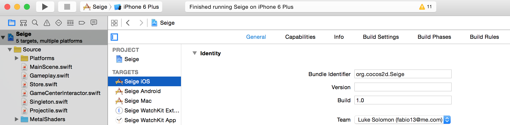

### 6.
Make sure you have GameCenter selected before clicking continue. If you're going to be adding in any other features such as In-app purchases, click those.

### 7.
Check to make sure that everything is how you want it, and click Submit.

Awesome! You're all done. Now let's move on to iTunes Connect.
	

##2. iTunes Connect
iTunes Connect has a much cleaner interface than the iOS Developer Center, and tends to be a much nicer experience to use, which is good because you should expect to use iTunes Connect much more often. Get started by following [this link.](https://itunesconnect.apple.com/)

### 1.
Begin by signing into your Developer Account. (Yes, mine is fabio13. I made it in 2005. I was 15. It was middle school. Let's move on)
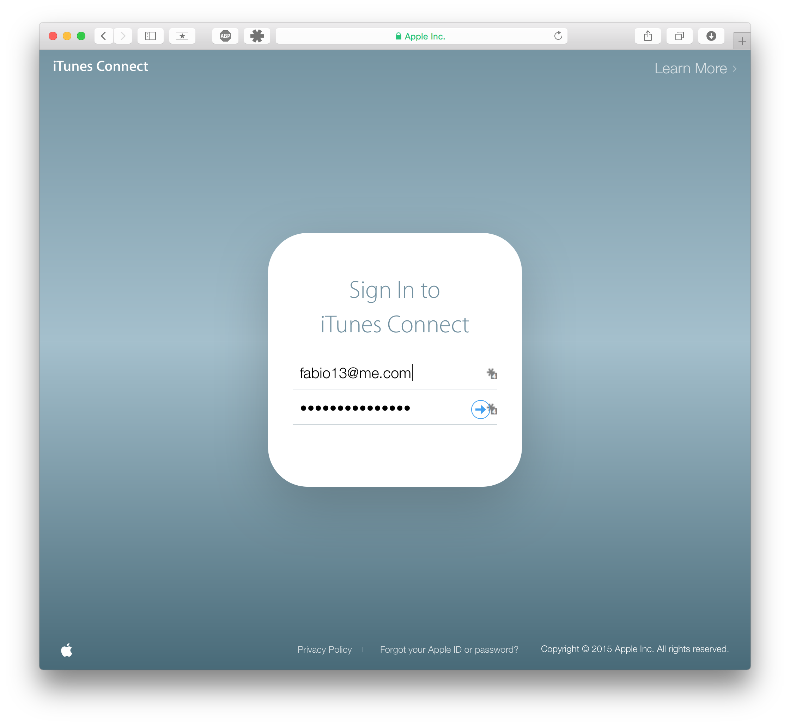

### 2.
Click My Apps
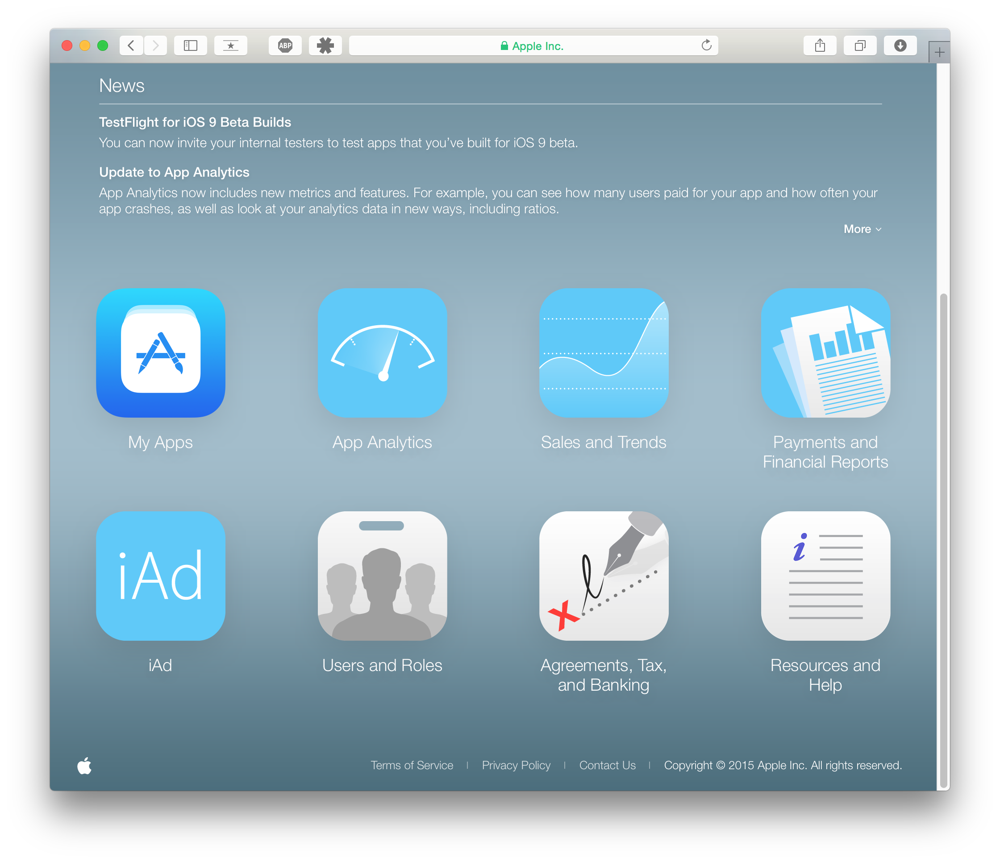

### 3.
Click the plus, then click New iOS App
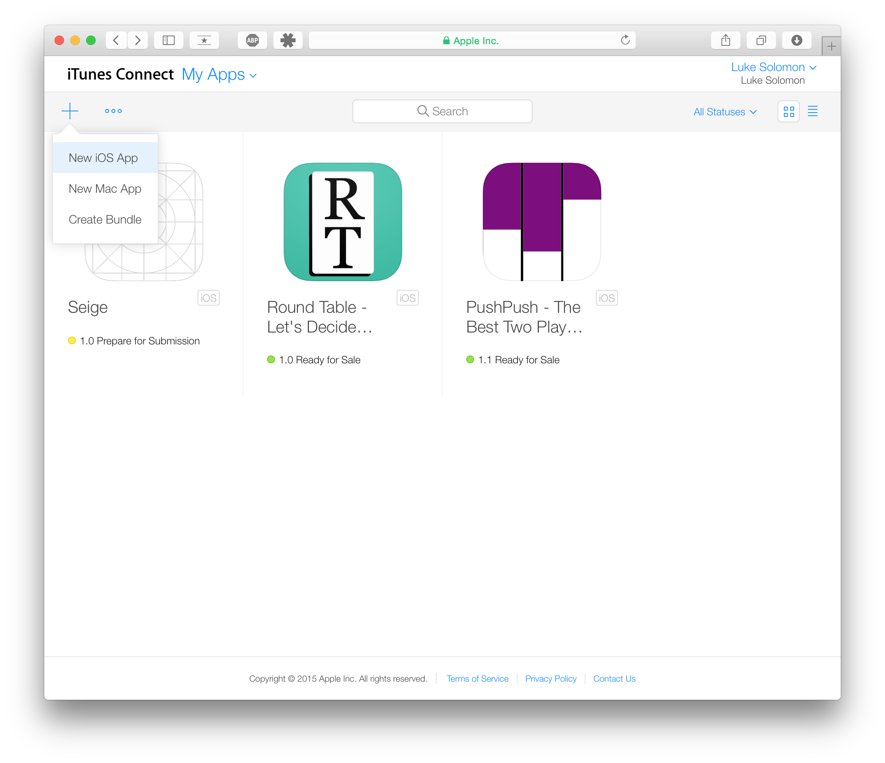

### 4.
Fill in the fields.
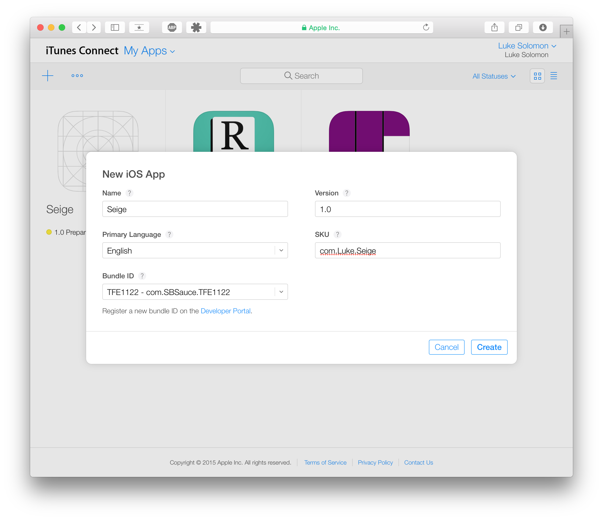

### 5.
Click Game Center
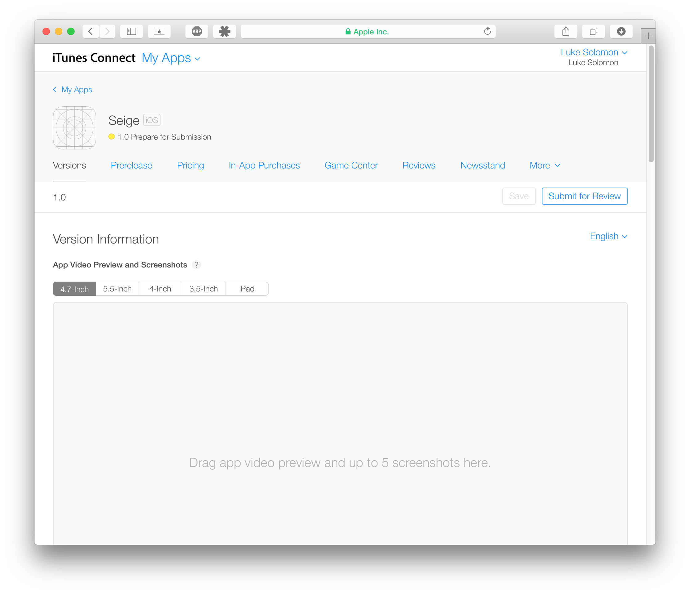

### 6.
Enable GameCenter for a single game (unless you're feeling ambitious and have multiple games)

### 7.
Add Leaderboard

### 8.
Choose Single Leaderboard
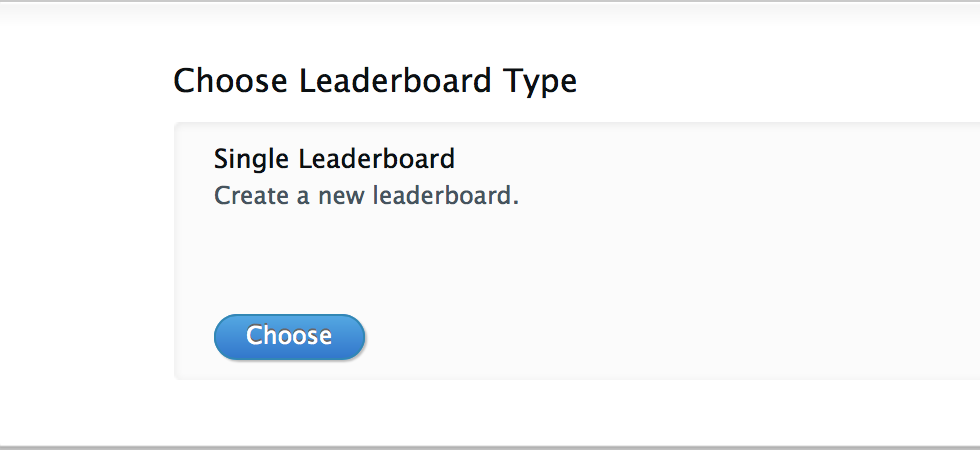

### 9.
Fill in the fields. 
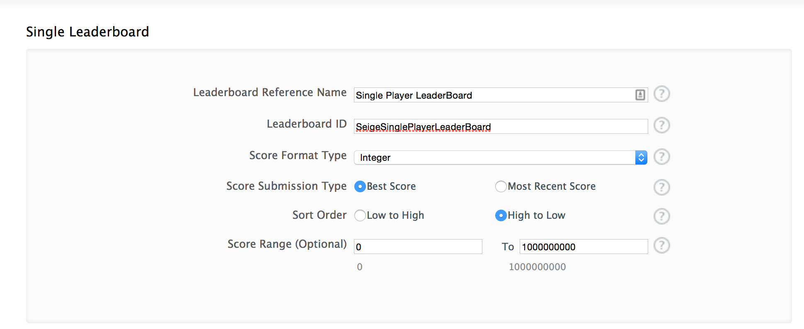

### 10.
Here you should fill in your 
Language, 

Name of the Leaderboard,

For Score format point, it should be fairly straightforward which you should pick on your game, based on what your player earns in game (points, dollars, etc.)

Score Format Suffixes,

and an optional image.
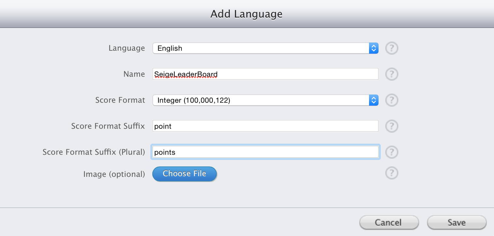

### 11.
The choice you make here should match how you are storing the user's score. 
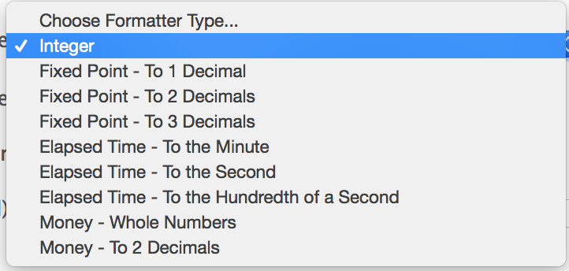

##3. XCode

### 1.
The next step is to add the GameKit framework into your app. Start by clicking on your Project in XCode, then on your App Target, and select Build Phases. Now click Link Binary with Libraries.
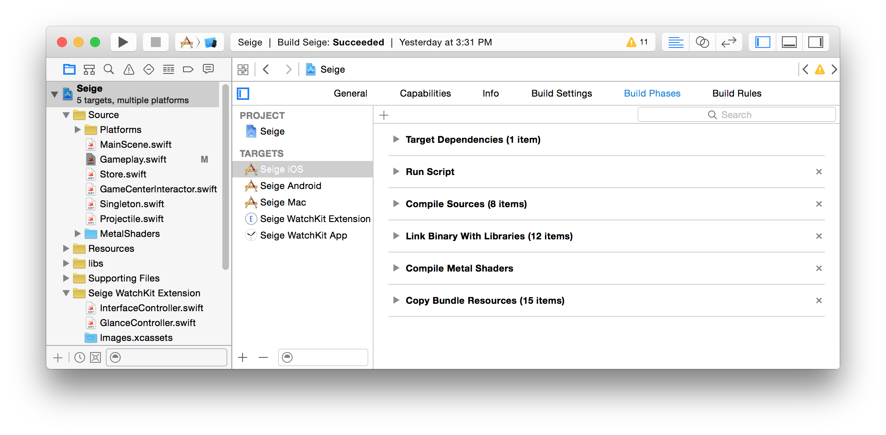

### 2.
Click the plus button next to "Drag to reorder frameworks."
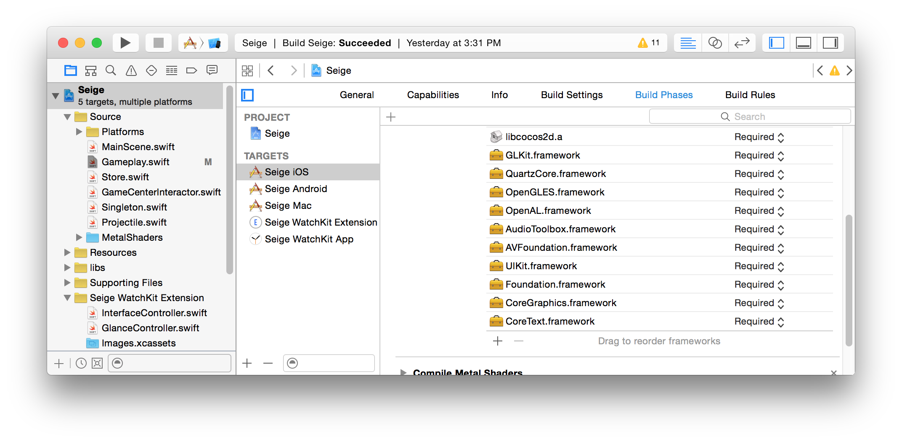

### 3.
Type GameKit into the search box, select it, and click add. 
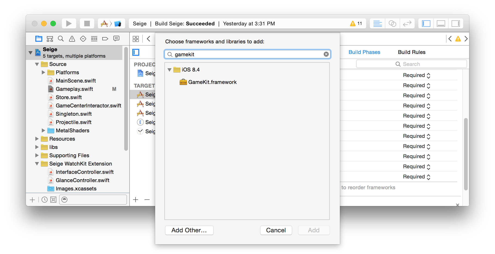

### 4. 
This next part requires some decision on your part. Import GameKit into whichever scene that you want to present your High Score table. If you want to present it when a user taps a specfic button, you'll put the showLeaderboard() method into the selector for that button that we'll create below.
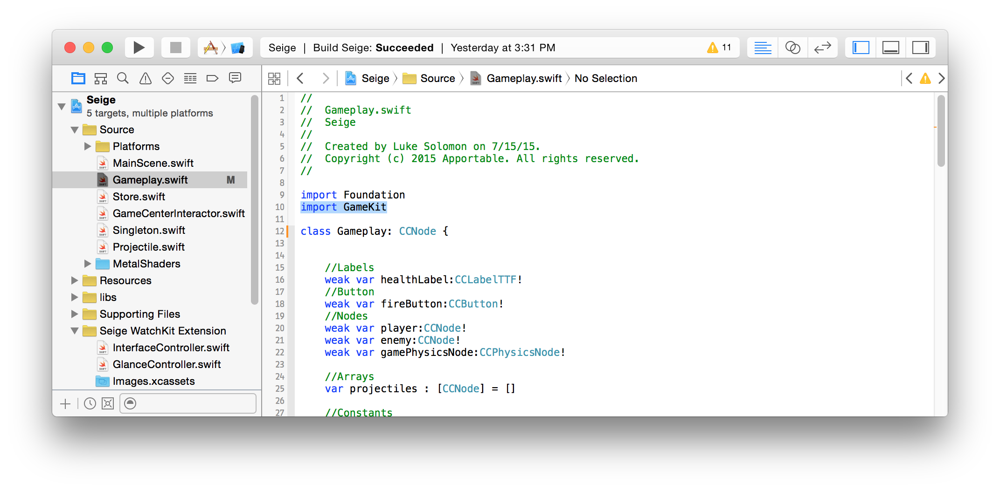

### 5. 
Now, we're going to add the following code as an extension to your class. You have the option to simply make your class a GKGameCenterControllerDelegate where you define your class, but by scrolling to the bottom of your class and putting your extension and all methods associated with the GKGameCenterControllerDelegate at the bottom, it really helps to clean your code up. It's also a snazzy new feature in Swift, so why not use it?

	// MARK: Game Center Handling
	extension Gameplay: GKGameCenterControllerDelegate {

	    func showLeaderboard() {
	        var viewController = CCDirector.sharedDirector().parentViewController!
	        var gameCenterViewController = GKGameCenterViewController()
	        gameCenterViewController.gameCenterDelegate = self
	        viewController.presentViewController(gameCenterViewController, animated: true, completion: nil)
	    }
	    
	    // Delegate methods
	    func gameCenterViewControllerDidFinish(gameCenterViewController: GKGameCenterViewController!) {
	        gameCenterViewController.dismissViewControllerAnimated(true, completion: nil)
	    }
    
	}
These are methods that we inherit from the GKGameCenterControllerDelegate. 

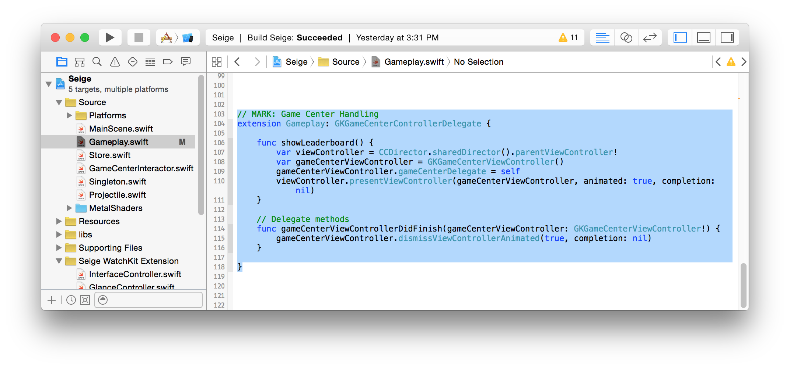

### 6.
Next, go to File->New->File. Now select iOS Source->Swift File-> Next. Save the file in your source folder, and erase the contents of the file, and replace them with the following code.

	//
	//  GameCenterInteractor.swift
	//  GameKitInteraction
	//
	//  Created by Stuart Breckenridge on 19/11/14.
	//  Copyright (c) 2014 Stuart Breckenridge. All rights reserved.
	//

	import UIKit
	import GameKit

	protocol GameCenterInteractorNotifications
	{
	    func willSignIn()
	    func didSignIn()
	    func failedToSignInWithError(anError:NSError)
	    func failedToSignIn()
	}

	class GameCenterInteractor: NSObject {
	    
	    // Public Variables
	    let localPlayer = GKLocalPlayer.localPlayer()
	    var delegate: GameCenterInteractorNotifications?
	    var callingViewController: UIViewController?
	    
	    // Singleton
	    class var sharedInstance : GameCenterInteractor {
	        struct Static {
	            static let instance : GameCenterInteractor = GameCenterInteractor()
	        }
	        return Static.instance
	    }
	    
	    //MARK: 1 Check authentication status
	    /**
	    This is the public method that begins the authentication process for the local player.
	    */
	    func authenticationCheck()
	    {
	        if (self.localPlayer.authenticated == false)
	        {
	            //Authenticate the player
	            println("The local player is not authenticated.")
	            self.authenticateLocalPlayer()
	        } else
	        {
	            println("The local player is authenticated")
	            // Register the listener
	            self.localPlayer.registerListener(self)
	            
	            // At this point you can download match data from Game Center.
	        }
	    }
	    
	    //MARK: 2 Authenticate the Player
	    /**
	    This is a private method to authenticate the local player with Game Center.
	    */
	    private func authenticateLocalPlayer()
	    {
	        self.delegate?.willSignIn()
	        
	        self.localPlayer.authenticateHandler = {(viewController : UIViewController!, error : NSError!) -> Void in
	            
	            if (viewController != nil)
	            {
	                dispatch_async(dispatch_get_main_queue(), {
	                    self.showAuthenticationDialogueWhenReasonable(presentingViewController: self.callingViewController!, gameCenterController: viewController)
	                })
	            }
	                
	            else if (self.localPlayer.authenticated == true)
	            {
	                println("Player is Authenticated")
	                self.localPlayer.registerListener(self)
	                self.delegate?.didSignIn()
	            }
	                
	            else
	            {
	                println("User Still Not Authenticated")
	                self.delegate?.failedToSignIn()
	            }
	            
	            if (error != nil)
	            {
	                println("Failed to sign in with error:\(error.localizedDescription).")
	                self.delegate?.failedToSignInWithError(error)
	                // Delegate can take necessary action. For example: present a UIAlertController with the error details.
	            }
	        }
	    }
	    
	    //MARK: 3 Show Authentication Dialogue
	    /**
	    When appropriate, this function will be called and will present the Game Center login view controller.
	    
	    :param: presentingViewController The view controller that will present the game center view controller.
	    :param: gameCenterController     The game center controller.
	    */
	    func showAuthenticationDialogueWhenReasonable(#presentingViewController:UIViewController, gameCenterController:UIViewController)
	    {
	        presentingViewController.presentViewController(gameCenterController, animated: true, completion: nil)
	    }
	}

	extension GameCenterInteractor:GKLocalPlayerListener
	{
	    // Add functions for monitoring match changes.
	}

### 7.	
Now it's time to add the code that authenticates the user into GameCenter. First things first, I want you to pick up your iPhone/iPod/iPad and press the home button. Now go to Settings->GameCenter->Developer and turn Sandbox on.

